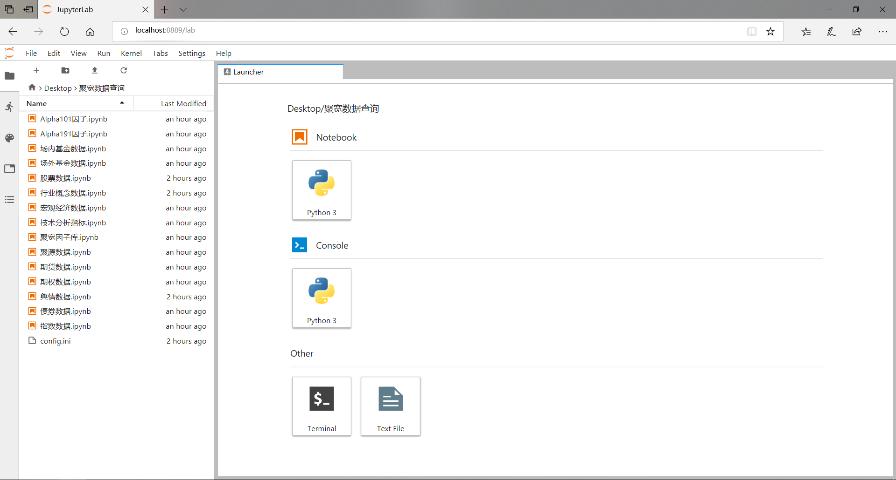
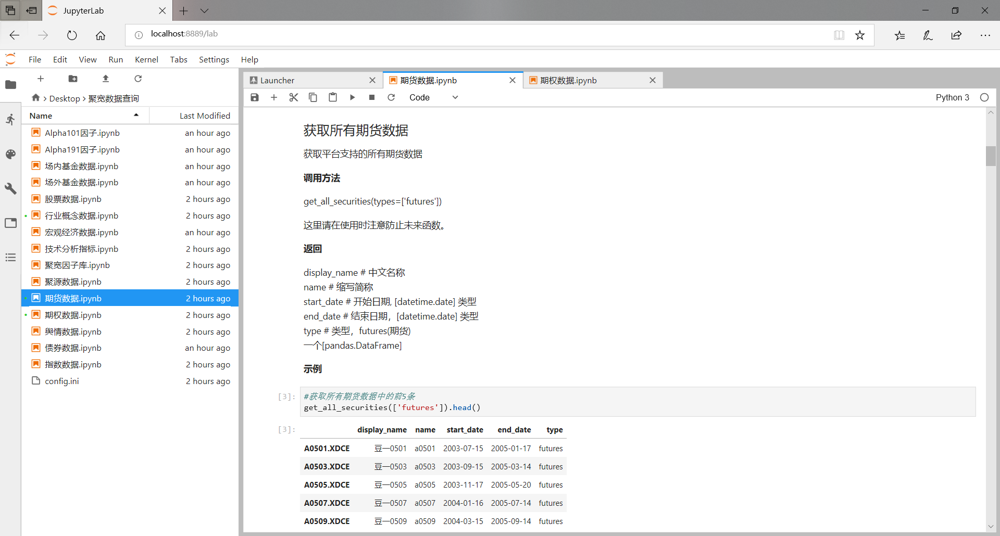
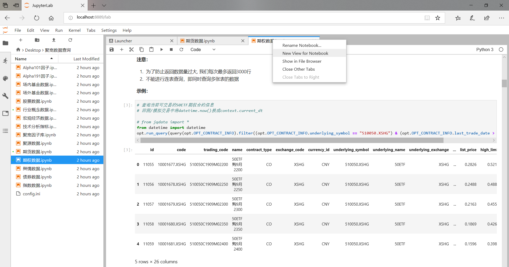
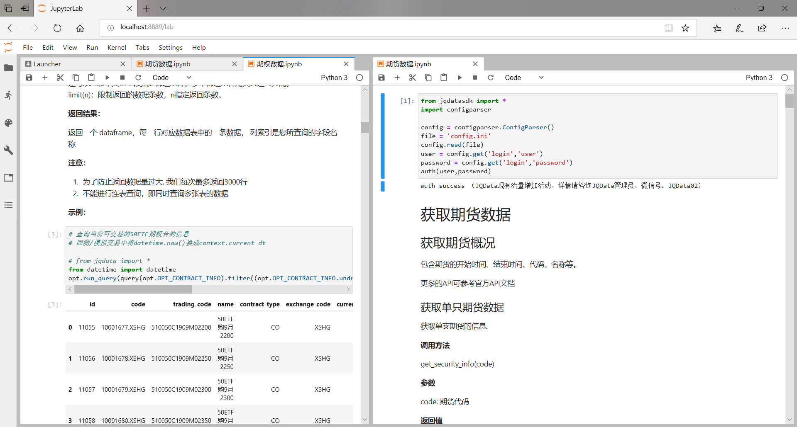
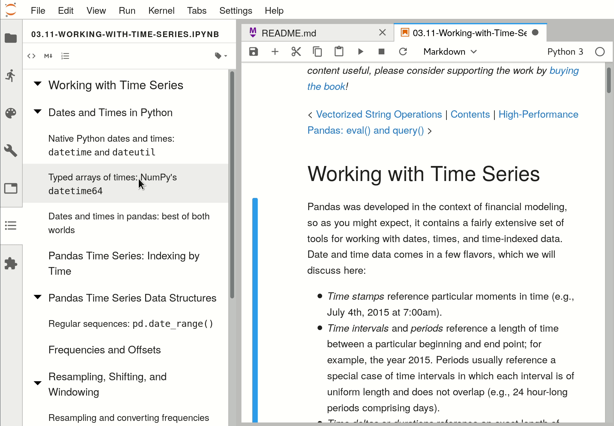
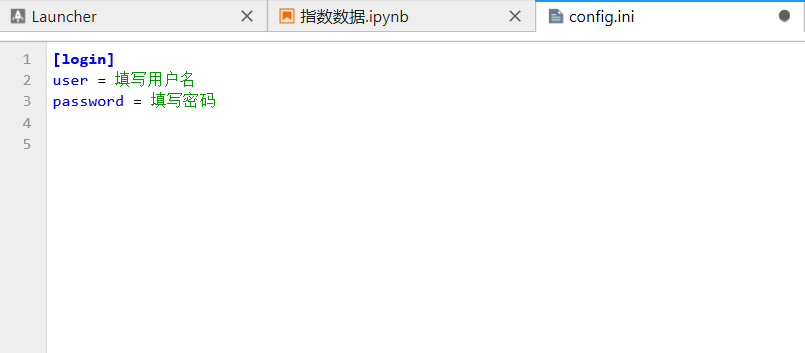
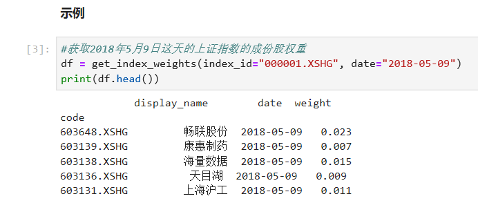

# 【API 超简单使用指南】 通过IPYNB格式带您一秒开箱JQData本地量化数据

**JQData本地量化数据服务** 支持python多版本及多操作系统（Pip即可直接安装使用），通过提供 **API接口** 的方式为财经类企业、金融机构、学术研究机构和量化爱好者们提供一站式财经信息服务及数据解决方案。
为了进一步满足用户的需求，聚宽数据团队将JQData数据字典中各类数据的 **API接口使用方式**（调用代码） 编写为**IPYNB**文件，在需要查询数据时直接找对应的代码，稍加修改就可直接运行实现数据调取，减少对说明文档的阅读投入，极大提升工作效率。


接下来为大家介绍如何使用**.ipynb**文件进行查询

> **1. 安装并使用JupyterLab**
>
> **2. 安装目录插件**
>
> **3. 如何使用IPYNB文件**


# **安装并使用JupyterLab**

## JupyterLab安装

JupyterLab是一个用于JupyterNotebook、代码和数据并基于Web的交互式开发环境，可以通过 `conda` 或 `pip`进行安装。

### conda

使用conda进行安装：

```
conda install -c conda-forge jupyterlab
```

### pip

使用pip进行安装：

```
pip install jupyterlab
```

安装的详情也可参考官网：https://jupyter.org/install

安装完成后点击文件夹中的 "**在此处启动jupyterlab.bat**" 可以在当前路径启动jupyterlab(如果只弹出cmd并且闪退,可能是您的jupyterlab没有安装成功,可以重新安装一下或者在cmd中输入 ` jupyter lab ` 检查一下)

### 若jupyter lab没有成功运行，网页显示404

(cmd会提示Please install nodejs 5+ and npm before continuing installation)

需要手动安装node js

下载地址：https://nodejs.org/en/download/

安装完成后，重新点击 "在此处启动jupyter lab.bat" 就可以运行了。


## JupyterLab使用

### 基本界面

JupyterLab的基本界面如下，与官网的研究环境较为相似（JupyterLab相当于在JupyterNotebook的基础上进行了升级）



类似在研究环境中的操作，打开侧边栏中需要进行查询的文件



相对于原来的Notebook在浏览两个文件时需要来回切换，JupyterLab增加了多窗口显示功能，方面我们同时查看多个文件：

右键单击文件的标签并选择`New View for Notebook`，之后便可以在两个窗口中进行显示






# 安装目录插件

JupyterLab本身不含目录功能，但在进行数据查找的过程中使用目录会极大提升效率。下面为大家介绍如何安装目录显示插件。

## 1 安装jupyter_contrib_nbextensions

在拥有JupyterLab的前提下安装jupyter_contrib_nbextensions：

可以直接通过`pip`进行安装

```
pip install jupyter_contrib_nbextensions
```


## 2 安装javascript和css文件

在命令行输入如下命令：

```
jupyter contrib nbextension install --user
```


## 3 安装jupyterlab-toc

在命令行输入：

```
jupyter labextension install @jupyterlab/toc
```

部分用户在安装时可能会出现错误

> Errored, use --debug for full output:
> ValueError: Please install nodejs 5+ and npm before continuing installation. nodejs may be installed using conda or directly from the nodejs website.*

出现这种情况需要自行安装`nodejs`和`npm`后再进行第三步的操作


安装完成目录插件后我们重新打开JupyterLab，便可以在左侧任务栏中看到目录界面。根据文件中使用Markdown记录的一级、二级、三级等标题自动生成目录，通过单击目录即可进行跳转：




# 如何使用IPYNB文件

拥有了JupyterLab之后我们便可以进行数据的查询和使用，目前数据字典https://www.joinquant.com/data中的数据除TuShare和JQData外均整理为IPYNB文件，用户可以根据需要在JupyterLab中打开使用

**注意**

**聚源数据**目前只能在研究环境中使用，因此需要在官网进行查看

以指数数据为例：

## 在配置文件中填写用户名与密码

在JupyterLab中打开`config.ini`文件



在对应的位置填写**用户名**与**密码**并保存（直接填写，无需加引号）


## 打开所要查询的IPYNB文件

以查询指数数据为例，在JupyterLab的任务栏中打开`指数数据.ipynb`，首先运行文件开头的单元格以登录JQData

选中单元格后并单击上方的运行按钮即可运行当前的内容，也可以使用快捷键`Shift+Enter`或`Ctrl+Enter`。运行完成之后显示**auth success**即表明登陆成功，可以访问数据。


## 通过目录定位至所要查询的数据

比如我们想要得到**指数成分股的权重**数据，首先在JupyterLab的左侧任务栏中单击**目录**，在产生的目录中选择**获取指数成分股权重**，即可跳转至对应的内容：


## 运行对应的单元格并获取数据

以上述同样的方法运行代码，在单元格下方得到输出结果：



同时也可根据自己的需求更改代码输出不同结果


------

**以上就是使用IPYNB格式JQData的方法，使用JupyterLab进行操作能极大提升我们的效率，快速定位至所需的位置并运行输出。长期以来 JoinQuant 聚宽专注于提升量化投资体验，解决用户在数据、因子、投研、仿真、实盘等各个环节的痛点，通过在线投研平台、JoinQuant 金融终端、JQData 数据、券商实盘等产品，助力量化投研与交易。我们期待着与您一同打造更好的 JoinQuant 金融终端。**

